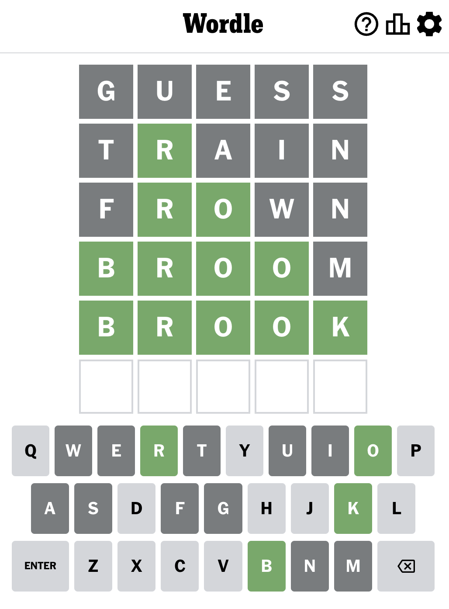

# Phantom-Plates

## Description
Wordle is often played online as a casual and challenging word game. It requires a mix of vocabulary knowledge, pattern recognition, and deduction skills. The game's popularity has led to various online versions and adaptations, each with slight variations in rules and presentation.

## Table of Contents
* [Installation](#installation)
* [Links](#Links)
* [How to Play](#howtoplay)
* [License](#license)
* [Credits](#credits)
* [Contributors](#contributors)
* [Report Bugs](#bugreport)

## Installation
N/A

## Links
Navigate to the following URL in your browser. 

https://wordle-app-delta.vercel.app/

## How To Play
Guess the Wordle in 6 tries.
Each guess must be a valid 5-letter word.
The color of the tiles will change to show how close your guess was to the word.

## Examples

**W** is in the word and in the correct spot.

**I** is in the word but in the wrong spot.

**U** is not in the word in any spot.

### Application Screenshot:
 

## License 
   

  [Read more about MIT License here.](https://opensource.org/licenses/MIT)
  
## Credits
- Font - Courtesy of [Google Fonts.](https://fonts.google.com)
- Fontend Toolkit - Courtesy of [React.](https://getbootstrap.com/)
- Code Walkthrough - Courtesy of [The Net Ninja.](https://www.youtube.com/watch?v=ZSWl5UwhHcs&ab_channel=TheNetNinja)

## Contributors
- Steven McCombe  [Github](https://github.com/Steven-McCombe)

## BugReport
- [E-mail Bug Report](mailto:bugreport@wordle.com)

